# CampusConnect Vulnerability Lab – Demonstration

This document maps each screenshot to the corresponding functionality or security vulnerability demonstrated in the application.

---

## 1. Login Page
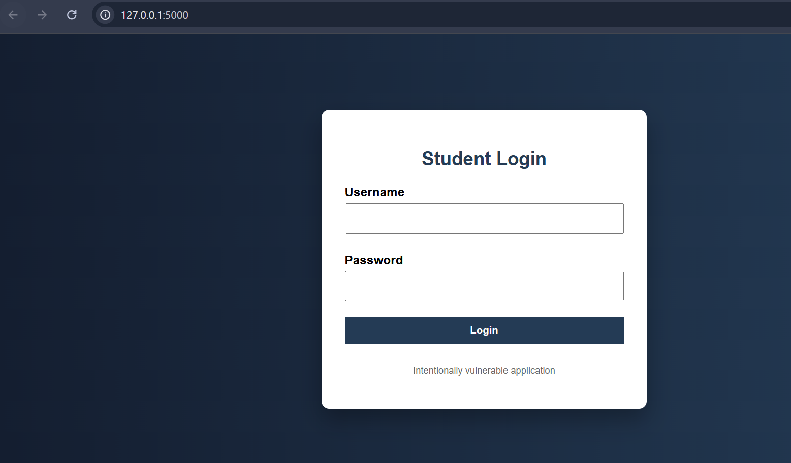

Description:  
Initial login interface of the CampusConnect application.

---

## 2. JavaScript Validation
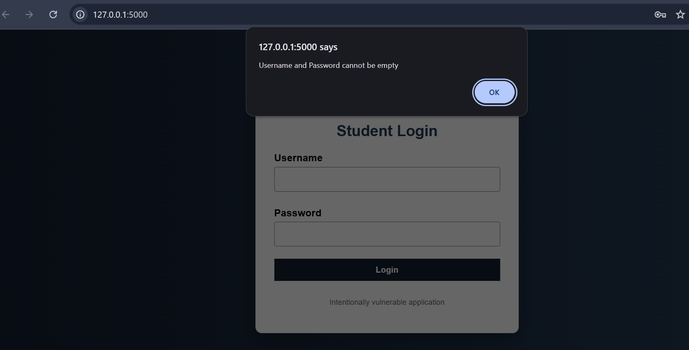

Description:  
Client-side JavaScript validation implemented in the login form.

---

## 3. Normal Login
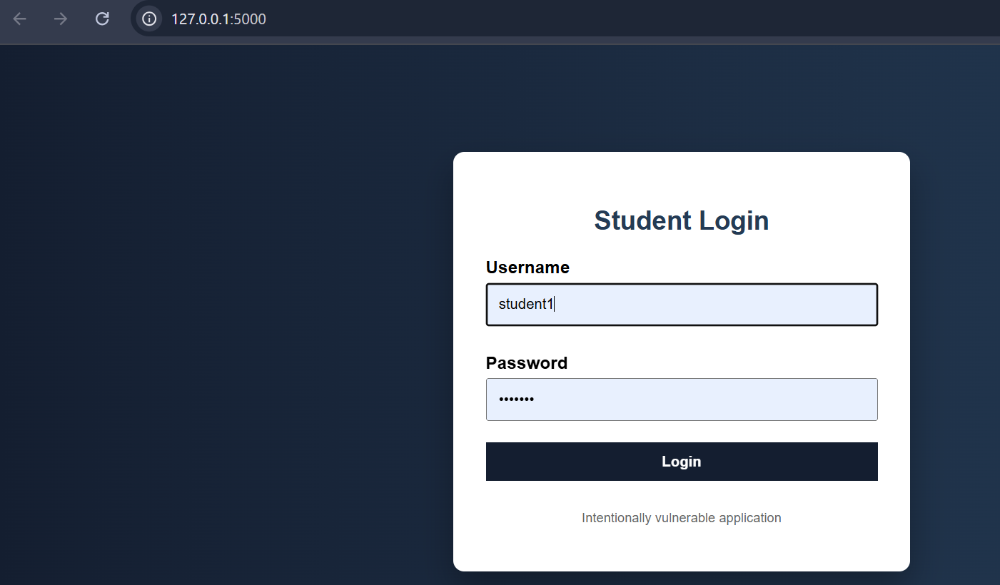

Description:  
Successful login using valid student credentials.

---

## 4. SQL Injection – Login Bypass
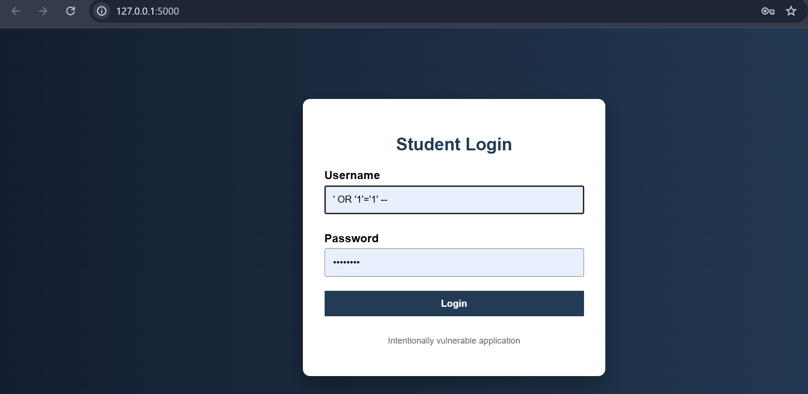

Description:  
Authentication bypass using SQL Injection payload in the login form.

---

## 5. Broken Authentication
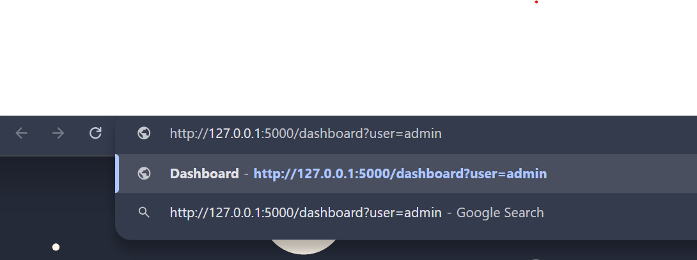

Description:  
User impersonation by directly modifying URL parameters.

---

## 6. Normal Marks View
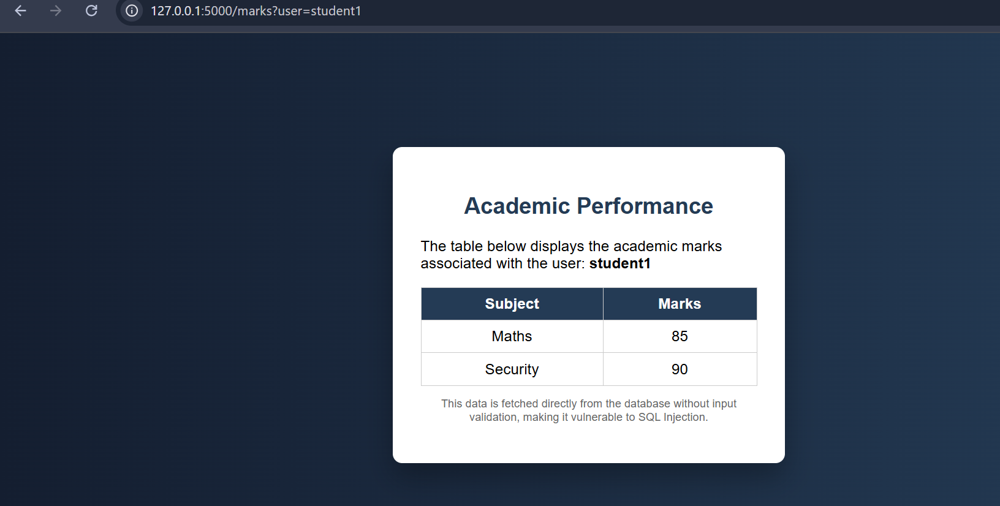

Description:  
Authorized student marks displayed correctly.

---

## 7. SQL Injection – Marks Exposure
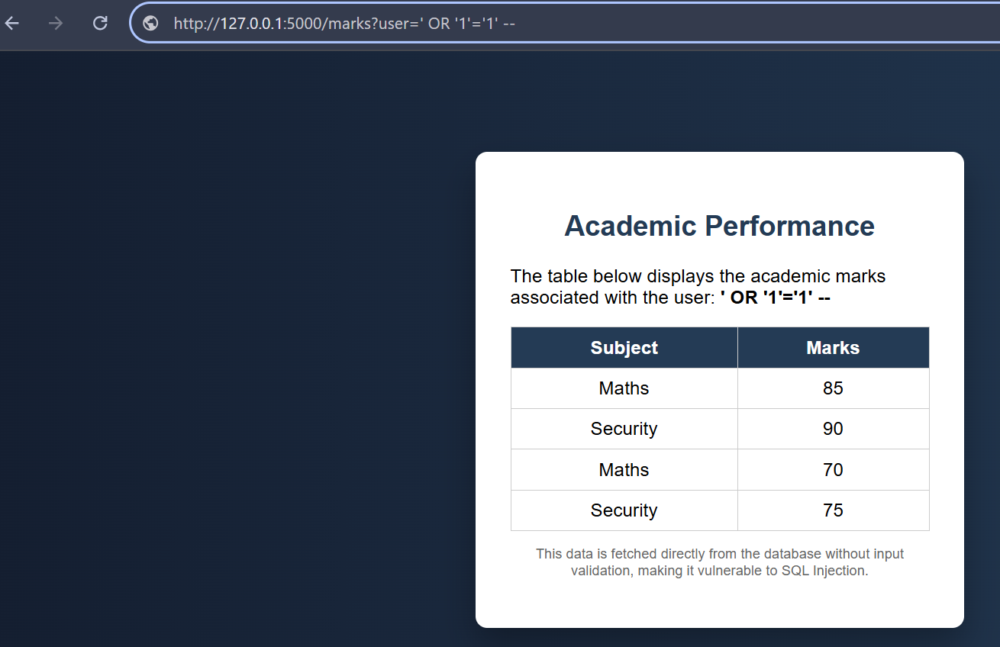

Description:  
Exposure of all students’ marks using SQL Injection.

---

## 8. JavaScript Warning (Discussion Module)
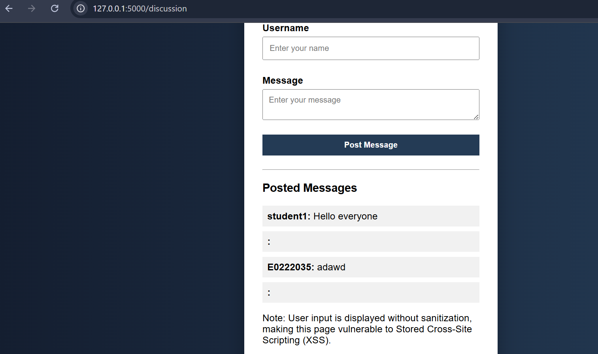

Description:  
Client-side JavaScript warning shown during discussion input.

---

## 9. Stored XSS Attack
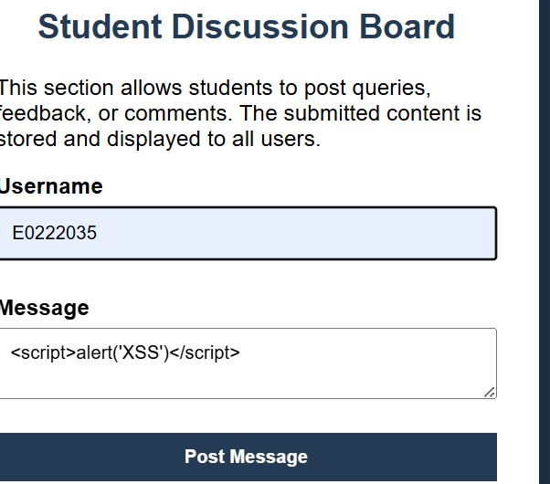

Description:  
Stored Cross-Site Scripting payload executed for all users.

---

## 10. Admin Panel – Security Misconfiguration
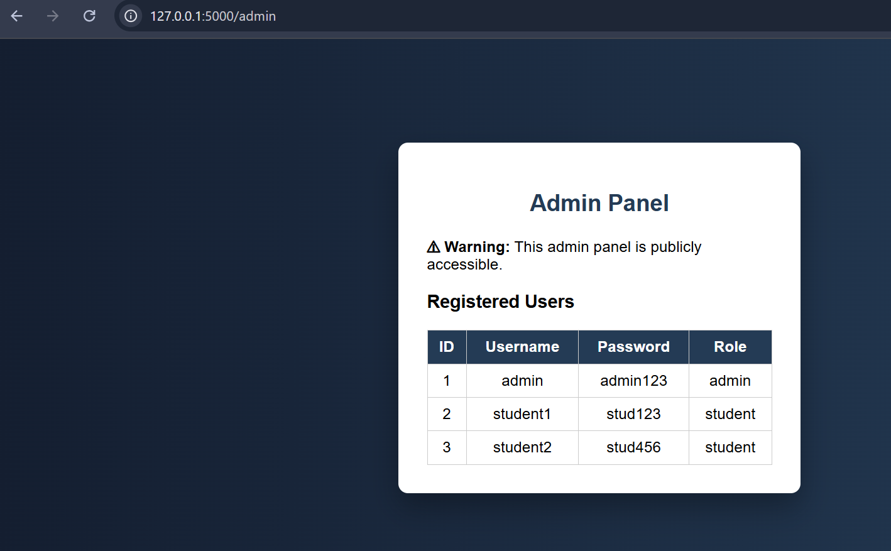

Description:  
Admin panel accessible without authentication due to misconfiguration.

---

## 11. Reflected XSS

Description:  
Immediate execution of malicious script via URL input.

---

## 12. IDOR Vulnerability
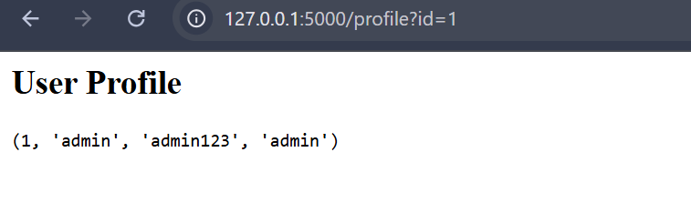

Description:  
Insecure Direct Object Reference allowing unauthorized data access.

---

## 13. Hardcoded Credentials
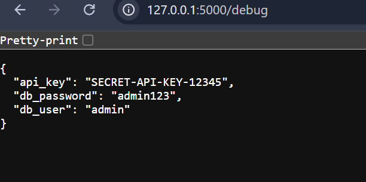

Description:  
Sensitive credentials exposed directly in source code.

---

## 14. Verbose Error Disclosure
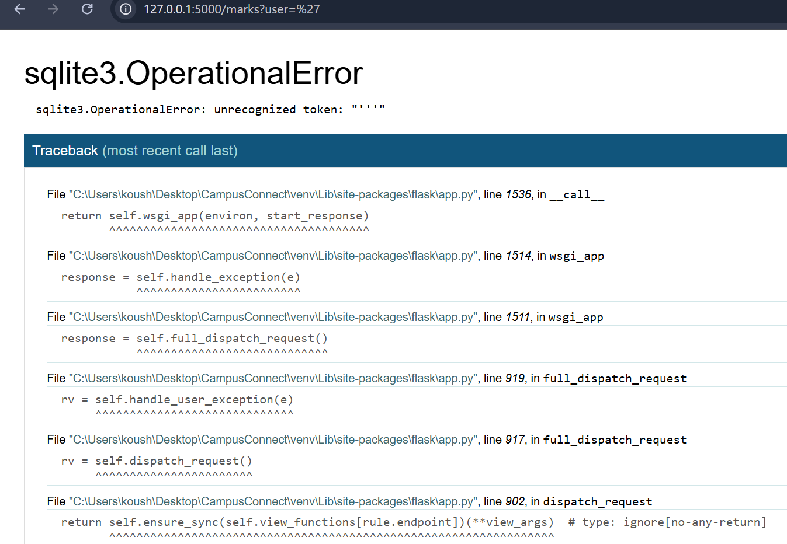

Description:  
Detailed system error messages revealing internal information.

---

## 15. Database Proof
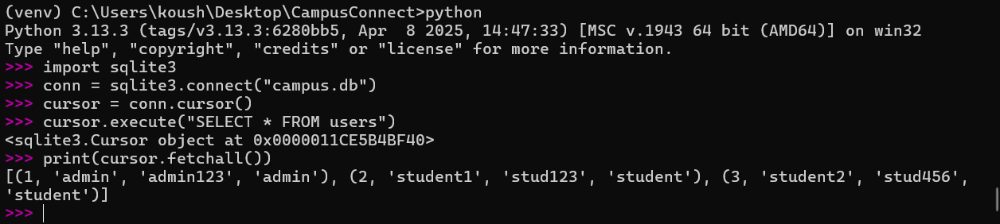

Description:  
Proof of database access and backend data exposure.
